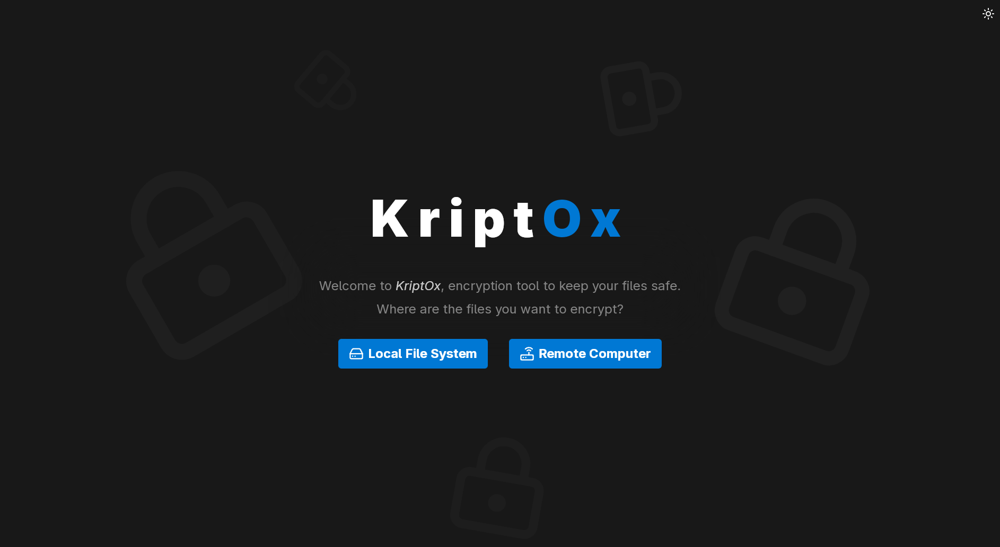
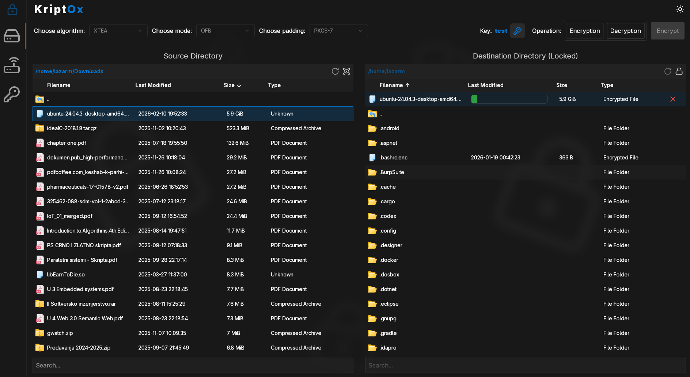
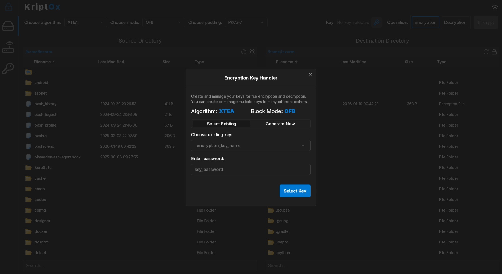
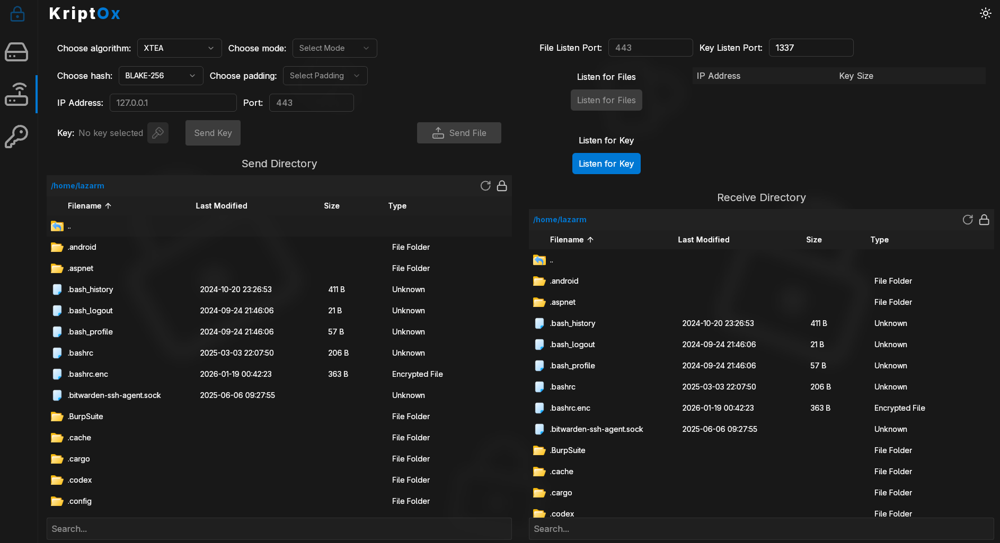
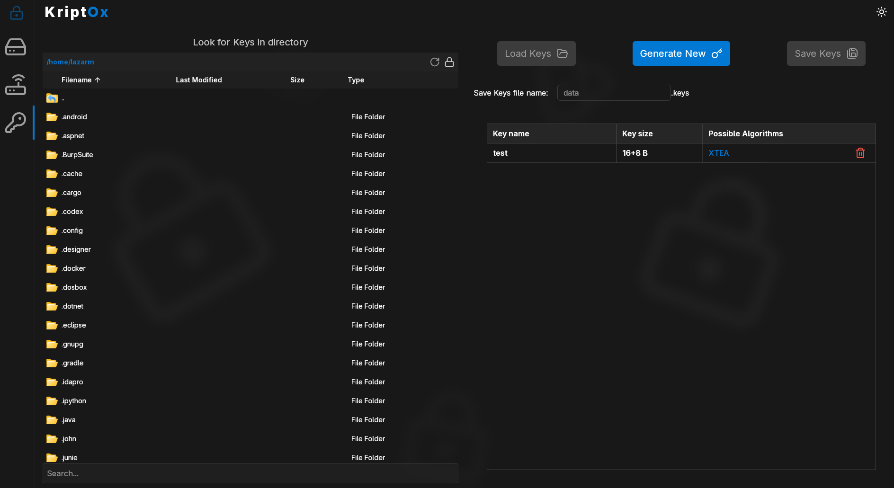
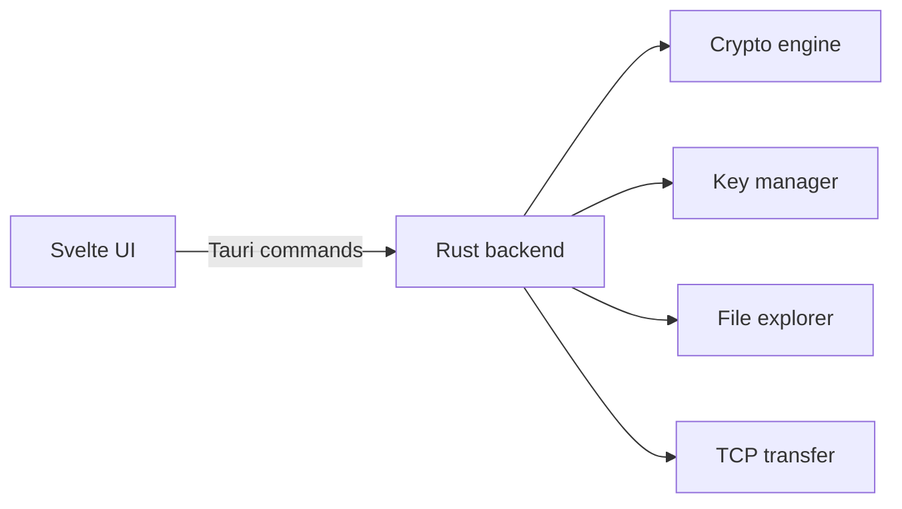

# KriptOx 🔐

<p align="center">
  <strong>Desktop toolkit for practical file cryptography.</strong><br/>
  Built with <strong>Svelte + Tauri</strong>, powered by <strong>Rust</strong> crypto modules.
</p>

<p align="center">
  
  
  
</p>

<p align="center">
  <strong>Stack versions:</strong> Tauri <code>2.6.2</code> • Rust <code>1.77.2</code> • Svelte <code>5.28.1</code>
</p>

## ✨ Overview

**KriptOx** is an information-security university project focused on real desktop workflows:

- 🔒 **Encrypt/decrypt files** with selectable algorithms
- 🗝️ **Manage keys locally**
- 🌐 **Transfer encrypted files** over TCP
- 🖥️ **Use a clean desktop UI** with a native backend

The frontend runs in **Svelte**, while cryptographic and system operations are implemented in **Rust** through **Tauri commands**.

## 🧠 Implemented Cryptography

| Category | Implemented |
|---|---|
| Block ciphers | **`AES-256`**, **`XTEA`** |
| Block mode | **`OFB`** |
| Stream ciphers | **`A5/1`** |
| Hash functions | **`BLAKE-256`** |
| Padding | **`PKCS#7`** |

## 🚀 Feature Set

- ✅ **File encryption and decryption jobs**
- ✅ **Key manager** for creating/storing keys
- ✅ **Local file explorer** integration
- ✅ **Encrypted TCP send/receive** flow
- ✅ **Job progress and cancellation** support

## 📸 Screenshots

<p align="center">
  
  
</p>
<p align="center">
  
  
</p>
<p align="center">
  
</p>

## ⚡ Quick Start

### Prerequisites

- Node.js 16+
- npm
- Rust (stable) + Cargo
- Tauri OS prerequisites

### Run in development

```bash
npm install
npm run tauri dev
```

### Build desktop app

```bash
npm install
npm run build
npm run tauri build
```

Build artifacts are generated under **`src-tauri/target/release/bundle`**.

## 🏗️ Architecture



## ⚠️ Security Notice

**KriptOx is an academic project.**
Do not treat it as production-grade cryptographic software without independent review, threat modeling, and security testing.

## 📄 License

This project is licensed under the **MIT License**.

- ✅ You can use, modify, and distribute it
- ✅ Commercial use is allowed
- ⚠️ It is provided **as-is**, without warranty

Full license text: **[`LICENSE`](./LICENSE)**.
